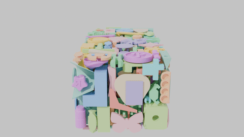
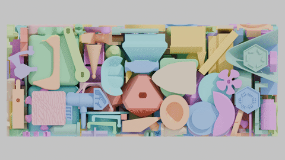

# Spectral 3D Bin Packing

[](https://www.python.org/downloads/)
[](https://opensource.org/licenses/MIT)
[](https://developer.nvidia.com/cuda-toolkit)

<p align="center">
  
</p>

<p align="center">
  <em>348 objects from Thingi10K packed into a 240×123×100mm tray at 60.8% density</em>
</p>

<p align="center">
  
</p>

<p align="center">
  <em>Cross-section reveals dense interior packing</em>
</p>

GPU-accelerated 3D bin packing using FFT-based collision detection.

This library implements the spectral packing algorithm described in
[Dense, Interlocking-Free and Scalable Spectral Packing of Generic 3D Objects](https://inkbit3d.com/packing/) (SIGGRAPH 2023), which uses
Fast Fourier Transform (FFT) operations for efficient collision detection
and optimal placement finding.

## Features

- **GPU-accelerated packing** using CUDA FFT operations
- **Multiple mesh formats**: STL, OBJ, PLY, OFF, GLTF, 3MF, and more
- **Simple Python API** with NumPy integration
- **Automatic mesh validation and repair** via trimesh
- **High-level and low-level APIs** for different use cases

## Requirements

### System Requirements

- **Python**: 3.8+
- **CUDA**: 11.0+ with CUDA Toolkit
- **GPU**: NVIDIA GPU with compute capability 6.0+
- **OS**: Linux (tested on Ubuntu)

### Build Requirements

- CMake 3.18+
- C++17 compiler (gcc 8+)
- CUDA Toolkit
- FFTW3 library (`libfftw3-dev`)
- pybind11

## Installation

### From Source

```bash
# Clone the repository
git clone <repository-url>
cd sc3344_final_cpsc424

# Install build dependencies
pip install scikit-build-core pybind11 cmake ninja

# Install the package
pip install -e .
```

### System Dependencies (Ubuntu/Debian)

```bash
# CUDA Toolkit (if not already installed)
sudo apt install nvidia-cuda-toolkit

# FFTW3
sudo apt install libfftw3-dev

# Build tools
sudo apt install cmake build-essential
```

## Quick Start

### Basic Packing

```python
from spectral_packer import BinPacker
import numpy as np

# Create a packer with a 100x100x100 voxel tray
packer = BinPacker(tray_size=(100, 100, 100))

# Create some voxelized items (3D numpy arrays)
items = [
    np.ones((5, 5, 5), dtype=np.int32),   # 5x5x5 cube
    np.ones((3, 3, 8), dtype=np.int32),   # 3x3x8 tall box
    np.ones((6, 6, 2), dtype=np.int32),   # 6x6x2 flat box
]

# Pack the items
result = packer.pack_voxels(items)

print(f"Packed {result.num_placed}/{len(items)} items")
print(f"Packing density: {result.density:.1%}")
```

### Packing from Mesh Files

```python
from spectral_packer import BinPacker

packer = BinPacker(tray_size=(100, 100, 100))

# Pack directly from mesh files
result = packer.pack_files([
    "item1.stl",
    "item2.obj",
    "item3.ply"
])

print(result.summary())
```

### Loading Meshes

```python
from spectral_packer import load_mesh, get_mesh_info

# Get mesh information
info = get_mesh_info("model.stl")
print(f"Vertices: {info['num_vertices']}")
print(f"Watertight: {info['is_watertight']}")

# Load and optionally center/scale
vertices, faces = load_mesh(
    "model.stl",
    validate=True,
    repair=True,
    center=True,
    scale=1.0
)
```

### Low-Level API

```python
from spectral_packer import (
    fft_search_placement,
    place_in_tray,
    voxelize_stl,
    calculate_distance
)

# Voxelize an STL file
item = voxelize_stl("model.stl", resolution=128)

# Create an empty tray
tray = np.zeros((100, 100, 100), dtype=np.int32)

# Find optimal placement
position, found, score = fft_search_placement(item, tray)

if found:
    # Place the item
    tray = place_in_tray(item, tray, position, item_id=1)
    print(f"Placed at {position} with score {score:.2f}")
```

## API Reference

### High-Level Classes

#### `BinPacker`

Main class for 3D bin packing operations.

```python
BinPacker(
    tray_size: Tuple[int, int, int],
    voxel_resolution: int = 128,
    height_penalty: float = 1e8
)
```

**Methods:**
- `pack_files(paths, sort_by_volume=True)` - Pack meshes from files
- `pack_voxels(items, sort_by_volume=True)` - Pack voxelized items
- `pack_single(item, tray=None)` - Find placement for single item

#### `PackingResult`

Results from a packing operation.

**Attributes:**
- `tray`: Final voxel grid with placed items
- `placements`: List of placement info for each item
- `num_placed`: Number of successfully placed items
- `num_failed`: Number of items that couldn't be placed
- `density`: Packing density (0.0 to 1.0)
- `total_volume`: Total occupied voxels

**Methods:**
- `get_item_mask(item_id)` - Get binary mask for specific item
- `save_vox(path)` - Save to MagicaVoxel format
- `summary()` - Get human-readable summary

#### `Voxelizer`

Mesh to voxel grid converter.

```python
Voxelizer(resolution: int = 128)
```

**Methods:**
- `voxelize_file(path)` - Voxelize a mesh file
- `voxelize_mesh(vertices, faces)` - Voxelize from arrays

### Low-Level Functions

| Function | Description |
|----------|-------------|
| `fft_search_placement(item, tray)` | Find optimal placement using FFT |
| `place_in_tray(item, tray, pos, id)` | Place item at position |
| `voxelize_stl(path, resolution)` | Voxelize STL file (C++) |
| `dft_conv3(a, b)` | 3D FFT convolution |
| `dft_corr3(a, b)` | 3D FFT cross-correlation |
| `calculate_distance(grid)` | Compute distance field |
| `collision_grid(tray, item)` | Compute collision metric |
| `make_tight(grid)` | Remove empty borders |
| `get_bounds(grid)` | Get bounding box of occupied voxels |
| `save_vox(grid, path)` | Save to MagicaVoxel format |

### Mesh I/O Functions

| Function | Description |
|----------|-------------|
| `load_mesh(path, ...)` | Load mesh with optional validation/repair |
| `get_mesh_info(path)` | Get mesh statistics without loading |
| `SUPPORTED_FORMATS` | Dict of supported file formats |

## Supported Mesh Formats

| Format | Extension | Notes |
|--------|-----------|-------|
| STL | .stl | Binary and ASCII |
| Wavefront OBJ | .obj | With materials |
| Stanford PLY | .ply | Binary and ASCII |
| OFF | .off | Object File Format |
| GLTF | .gltf, .glb | GL Transmission Format |
| 3MF | .3mf | 3D Manufacturing Format |
| COLLADA | .dae | XML-based format |

## Algorithm

The spectral packing algorithm works as follows:

1. **Voxelization**: Convert 3D meshes to binary occupancy grids
2. **Collision Detection**: Use FFT correlation to efficiently compute
   where items can be placed without collision
3. **Scoring**: For each valid position, compute a score based on:
   - Proximity to existing items (encourages tight packing)
   - Height penalty (prefers bottom placements)
4. **Greedy Placement**: Place items one by one in descending volume order

The key insight is that collision detection can be formulated as a
convolution, which can be computed efficiently using FFT in O(n log n)
time rather than O(n²) for naive approaches.

## Examples

See the `examples/` directory for complete examples:

- `basic_packing.py` - Simple packing demonstration
- `multi_format_demo.py` - Loading various mesh formats
- `benchmark.py` - Performance benchmarking

## Running Tests

```bash
# Install test dependencies
pip install pytest pytest-cov

# Run tests
pytest tests/ -v

# Run with coverage
pytest tests/ --cov=spectral_packer
```

## Development

### Building from Source

```bash
# Create a build directory
mkdir build && cd build

# Configure with CMake
cmake .. -DBUILD_PYTHON_BINDINGS=ON

# Build
make -j$(nproc)
```

### Project Structure

```
psacking/
├── README.md                # This file
├── pyproject.toml           # Python package config
├── CMakeLists.txt           # Root CMake config
├── spectral_packing/        # C++/CUDA implementation
│   ├── bindings.cpp         # pybind11 bindings
│   ├── packing.cpp          # Core algorithm
│   ├── fft3.cu              # CUDA FFT operations
│   └── VoxSurf/             # Voxelization library
├── spectral_packer/         # Python package
│   ├── __init__.py          # Public API
│   ├── packer.py            # BinPacker class
│   ├── mesh_io.py           # Mesh loading
│   └── voxelizer.py         # Voxelization
├── tests/                   # Test suite
└── examples/                # Example scripts
```

## License

MIT License

## Citation

If you use this code in your research, please cite the original paper:

```bibtex
@article{10.1145/3592126,
  author = {Cui, Qiaodong and Rong, Victor and Chen, Desai and Matusik, Wojciech},
  title = {Dense, Interlocking-Free and Scalable Spectral Packing of Generic 3D Objects},
  year = {2023},
  issue_date = {August 2023},
  publisher = {Association for Computing Machinery},
  address = {New York, NY, USA},
  volume = {42},
  number = {4},
  issn = {0730-0301},
  url = {https://doi.org/10.1145/3592126},
  doi = {10.1145/3592126},
  abstract = {Packing 3D objects into a known container is a very common task in many industries such as packaging, transportation, and manufacturing. This important problem is known to be NP-hard and even approximate solutions are challenging. This is due to the difficulty of handling interactions between objects with arbitrary 3D geometries and a vast combinatorial search space. Moreover, the packing must be interlocking-free for real-world applications. In this work, we first introduce a novel packing algorithm to search for placement locations given an object. Our method leverages a discrete voxel representation. We formulate collisions between objects as correlations of functions computed efficiently using Fast Fourier Transform (FFT). To determine the best placements, we utilize a novel cost function, which is also computed efficiently using FFT. Finally, we show how interlocking detection and correction can be addressed in the same framework resulting in interlocking-free packing. We propose a challenging benchmark with thousands of 3D objects to evaluate our algorithm. Our method demonstrates state-of-the-art performance on the benchmark when compared to existing methods in both density and speed.},
  journal = {ACM Trans. Graph.},
  month = jul,
  articleno = {141},
  numpages = {14},
  keywords = {3D packing}
}
```

## References

- [Dense, Interlocking-Free and Scalable Spectral Packing of Generic 3D Objects](https://inkbit3d.com/packing/) - Original paper (SIGGRAPH 2023)
- [pybind11](https://pybind11.readthedocs.io/) - C++/Python bindings
- [trimesh](https://trimsh.org/) - Mesh processing library
